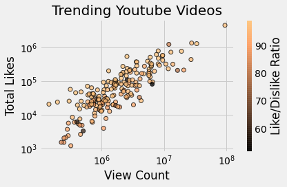

2. How to add a legend ?

```python
# Plotları yaradanda label argumentine ad ver ve sonda da plt.legend çağır

plt.plot(x, y1, label="Birinci")
plt.plot(x, y2, label="İkinci")

plt.legend()
```

# Scatter Plot

Given Simple scatter plot: 

```python
import matplotlib.pyplot as plt

# x is gdp per capita. 
# y is life expectancy
# 
plt.scatter(x = gdp_cap, y = life_exp)
plt.show()
```

- add labels

  ```python
  plt.xlabel('GDP per Capita [in USD]')
  plt.ylabel('Life Expectancy [in years]')
  ```

- add title

  ```python
  plt.title('World Development in 2007')
  ```

- add sizes to each point. This will size each point in the graph according to its value

  ```python
  sizes = [0.1, 0.1, 2, 0.5]
  plt.scatter(x, y, s=sizes)
  ```

- add color to each point

  ```python
  # colors: a list with a color for each point. ['black', 'red', 'yellow', ...]
  plt.scatter(x, y, s=sizes, c=colors)
  ```

- To change the brightness of the colors of the points:

  set alpha to a value:

  ```python
  plt.scatter(x = gdp_cap, y = life_exp, s = np.array(pop) * 2, c = colors, alpha = 0.8)
  ```

- To set x and y ticks where we want. 

  ```python
  # x oxunda sadece bu reqemler olacaq 
  plt.xticks([1000,10000,100000], ['1k','10k','100k'])
  ```

- To add text inside the graph:

  ```python
  plt.text(1550, 71, 'India')
  plt.text(5700, 80, 'China')
  ```

- To add grid lines:

  ```python
  plt.grid(True)
  ```

  

3. How to apply different plot style ?

```
- plt.style.available --> this will show available styles
- plt.use(stylename) -->
```

4. How to apply comics style graph ?

```
- plt.xkcd()
```

5. How to make a bar to be transparent with respect to other bar ?

```
plt.bar(d_index, dev_y, color="blue", zorder=3, label="All dev")
plt.bar(d_index, pydev_y, color="green",zorder=1, label="Python dev")
plt.bar(d_index, jdev_y, color="red", zorder=2, label="Javascript dev")


- giving higher zorder value makes the bar less transparent. 
```


6. How to make side by side barcharts in a figure ? 
- Define the **width** parameter and then change each bar with that value

```
width=0.25
plt.bar(d_index-width, dev_y, color="blue", width=width, label="All dev")
plt.bar(d_index, pydev_y, color="green", width=width, label="Python dev")
plt.bar(d_index+width, jdev_y, color="red", width=width, label="Javascript dev")
```

7. How to make horizontal barchart ?

```
plt.barh() instead of plt.bar()
```

8. How to make pie chart ?

```
slices = [59249, 55466, 47544, 36443, 35917]
labels  ["JS", "HTML", "SQL", "Python", "Java"]

explode = [0, 0, 0, 0.1, 0]
plt.pie(slices, labels=labels, explode=explode,
        shadow=True, wedgeprops={"edgecolor":"black"}, 
        explode=explode, autopct="%1.1f%%")
```

explode --> if you want to crop a class from others

wedgeprops --> to add border between classes

shadow --> to put shadow

autopct --> to add percentages

9. How to make histogram ?

```
plt.hist(ages, edgecolor="black", 
         bins=bins, log=True)

plt.axvline(median_age, color="#EF7C8E", label="Age Median")
plt.title("Distribution of ages in Survey")
plt.xlabel("Age")
plt.ylabel("Total Respondends")
plt.legend()
plt.tight_layout()
```

axvline --> to draw vertical line

10. How to make scatterplot to see correlation between variables ? 

```python
plt.scatter(counts, likes, c=ratios, cmap="copper",
            alpha=0.75, edgecolor="black", linewidth=1)

cbar = plt.colorbar()
cbar.set_label("Like/Dislike Ratio")

plt.xscale("log")
plt.yscale("log")

plt.title("Trending Youtube Videos")
plt.xlabel("View Count")
plt.ylabel("Total Likes")

plt.tight_layout()
```

**cbar** --> colorbar near the figure

**.xscale** --> to scale x

**.yscale** --> to scale y

**alpha** --> brightness of the color of the dots

**c** --> colors

**cmap** --> type of the color map



We can also change the radius of the dots for a column :

```
plt.scatter(counts, likes, s=follower_size, c=ratios, cmap="copper",
            alpha=0.75, edgecolor="black", linewidth=1)
```

Here s=follower\_size, will change the sizes of the dots according to the follower size.


11. what **matplotlib.rc** in **matplotlib** ?
* It is the runtime configuration for the plot elements. Starting the runtime you can configure it:

```
import matplotlib as mpl

mpl.rc("axes", labelsize=14)
mpl.rc("xtick", labelsize=12)
mpl.rc("ytick", labelsize=12)
```

12. How to set the x and y axis intervals ?

```
plt.axis([0, 10, 1, 15]) --> x will be between 0 and 10 and 
                                y between 1 and 15 
```

13. How oop matplotlib works ?

```
fig, axes = plt.subplots(nrows=1, ncols=3, figsize=(10,4))
axes[0].plot()
axes[1].plot()
axes[2].plot()
```

14. How to set vertical range between 0 and 1 ?

    ```python
    plt.gca().set_ylim(0, 1)
    ```

15. How does plt.subplots work ?

16. 
