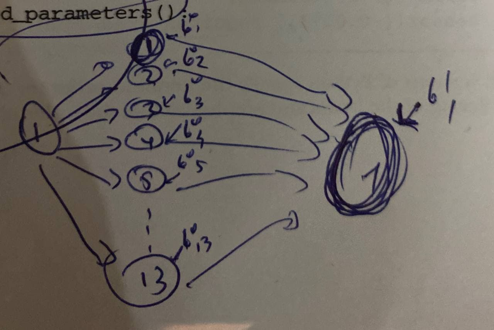

## Basic Neural Network

```
import torch.nn as nn
import torch.optim as optim
```

1. Sequential Model --> a model consisting of several layers.

```
seq_model = nn.Sequential(
                nn.Linear(1, 13),
                nn.Tanh(),
                nn.Linear(13, 1))
```

2. To see the shapes of parameters:

```
[param.shape for param in seq_model.parameters()]

[torch.Size([13, 1]),
 torch.Size([13]), 
torch.Size([1, 13]), 
torch.Size([1])]
```

3. To see the shapes of parameters with their names:

```
[(name, param.shape) for name, param in seq_model.named_parameters()]


[('0.weight', torch.Size([13, 1])), 
('0.bias', torch.Size([13])), 
('2.weight', torch.Size([1, 13])), 
('2.bias', torch.Size([1]))]
```

4. In pytorch as you can see from the figure below and from the shapes given before,  one bias is added for each node.



the NN model is 1 -- 13 -- 1. Bias shapes are 13 and 1. One bias for each node. 

5. We can also give name to each layer like this:

```
seq_model = nn.Sequential(OrderedDict([
    ("hidden_linear", nn.Linear(1, 13)),
    ("hidden_activation", nn.Tanh()),
    ("output_linear", nn.Linear(13, 1))
])
```

output will be like below. This is more readable and easy to understand.

```
[('hidden_linear.weight', torch.Size([13, 1])), 
('hidden_linear.bias', torch.Size([13])), 
('output_linear.weight', torch.Size([1, 13])), 
('output_linear.bias', torch.Size([1]))]
```
