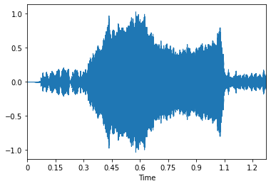
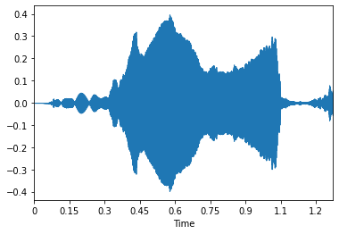
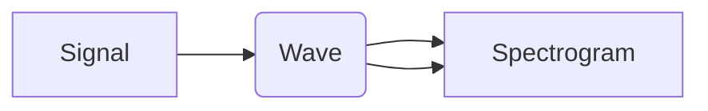

# TERMS

1. **Sampling Frequency**: number of frames per second. 16khz, means 16000 frames per second.

2. **Resolution:** How many bits a frame will take. 16bit is used generally.

3. **Phoneme**: Simplest sound unit. Written representation of  a voice. Example: $\theta$ 

4. **Grapheme:** Representation of phoneme with asci characters. Example: th

5. **Amplitude**: Loudness of the sound

6. **Frequency**: The pitch of the sound

7. **Timbre**: Quality of the sound or the identity of the sound. (Sound difference between a violin and a piano)

8. 

## Problems needed to solve to apply ASR

1. Convert the analog signal (acoustic wave) to digital representation

2. Seperate the signal from noice. Meaning, someone is talking --> this is the signal, but there are other people also talking in background or a phone ringing --> these are the noices.

3. Deal with sentence endpoints. Find where the sentence ends.

4. Variability in the speech. Even one person can say the same word differently, each time.

5. Find which meaning is stated when **homophones** are used.

homophone --> same pronouncuation but different meaning

6. Filter fillers like "mm", "err", "hmm".

## Components of ASR

1. Digital representation of input

2. Feature extraction. Identify parts of the input containing speech and transform to acoustic parameters.

3. Acoustic Model: 
   
   - Takes the waveform and breaks to small fragments.
   
   - Predicts most likely phonemes of those fragments.

4. Pronounciation Model: Takes sound and ties them together to make words. 

5. Language Model : Takes the  words and ties them together to make meaningful sentences. 

6. Decoder:  Algorithms to search the hypothesis space efficiently. Combines the predictions of acoustic and language model to predict the most likely sentence.

## Feature Extraction

Theory:

1. Divide the audio waveform to 25ms windows with 10ms sliding. Apply Fourier transform to each window and find MFCC features for each window.

2. 

1. Some basic tools:

```
import librosa --> main asr feature extraction tool
import librosa.display --> for plots
import noisereduce as nr --> best noice reducer, 
                    uses same method as audacity
```

2. to load the waveform to numpy we will use librosa:

```
waveform, sampling_rate = librosa.load("audio_file.wav")
```

wavefrom --> numpy array

sampling rate is the sampling rate of the audio

```
waveform
array([0.        , 0.        , 0.        , ..., 0.04594884, 0.05876281,
       0.        ], dtype=float32)
```

3. To display the waveform:

```
librosa.display.waveplot(waveform)
```



4. To reduce the noice in the audio:

```
noisy_part = waveform[0:25000]  
reduced_noise = nr.reduce_noise(audio_clip=waveform, 
                                noise_clip=noisy_part, 
                                verbose=False)
```

Now draw the noice reduced audio:



5. Next step is to trim the silences:

```
trimmed, index = librosa.effects.trim(reduced_noise, 
                                      top_db=20, 
                                      frame_length=512, 
                                      hop_length=64)
```

**top_db** --> threshold for decibel. So decibel below than top_db will be trimmed.

# ASR presentation pycon-2018

**Signal**: Continuous Mathematical function.

**Wave**: Contains an array of discrete samples.

**Spectrum**: Contains the discrete fourier transform of the wave.



Given a **Signal** which is continuous, I can sample it and get a **Wave**. So **Wave** is a discrete sequence of **Signals**. Given a **Wave**, I can compute a **Spectrum**. Also, given a **Spectrum** I can go back and compute the corresponding **Wave**.

**Sound Signal** : Variations in air pressure over time

**Microphone**: Measures the variations in air pressure and generates electrical signals that represent sound.

**Speaker**: Takes and electrical signal and generates a **sound**. 

**Periodic Signals**: Signals that repeat themselves after some period of time. For example, if you ring a bell, it vibrates and generates a periodic sound. 


**Cycle**: One full repetition of a periodic wave. In this cosine wave, we see that there are 3 cycles.

**Period**: Duration of one cycle. In the cosine wave given above, we see that perios is 2.3 miliseconds.

**Frequency**: Number of cycles per second. It is also the inverse of a **Period**. 1000/2.3=**439** . In this graph, **frequency** is 439hz. **Hz(hertz)** is the frequency unit, meaning number of cycles per second.

The shape of a periodic signal is called a **waveform**. 

**Spectral Decomposition**: Any signal can be expressed as the sum of sinusoids with different frequencies. 

**Low Pass filter**:  To remove frequencies above the given threshold

**High Pass filter**: To remove the frequencies below the given threshold

The lowest frequency component is called the **fundamental frequency**.

When the sampling rate is 10,000 hz, the highest frequency we can measure correctly is 5000hz, above that will appear to be a low frequency signal. This is called **Nyguist theorem**, we can correctly sample frequencies below the half of the sample rate. This is also called "**folding frequency**"


**Chapter 6**


1. Sinusoid function is given below:

$$
y_s = A * cos(2*\pi*f_s*t_s)
$$

fs --> frequency

ts --> time.

A --> amplitude

```
ts = np.linspace(0, 1, 11025)
A = 0.1
fs = 100

ys = 0.1*np.cos(2*np.pi*fs*ts)
```


2. To make an audio

```
from IPython.display import Audio


audio = Audio(data=ys, rate=11025)
```

3. 
