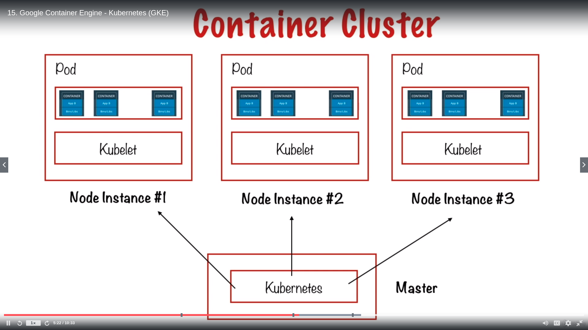

1) Create cloud instance from cloud shell. This will create a cloud instance named **testc** on **us-central1-a** zone.

```
gcloud compute instances create testc --zone us-central1-a
```

2) Config from cloud shell the default zone to **us-central1-b**. 

```
gcloud config set compute/zone us-central1-b
```

If we create an instance by default it will be assigned to zone **us-central1-b**

3) To connect to an instance through ssh:

```
gcloud compute ssh testc
```

If the instance is in another zone --> then it will not ssh. So you should give the zone name:

```
gcloud compute ssh testc --zone us-central1-a
```

4. To create a persistent disk:
   
   ```
   gcloud compute disks create disk-2 --size=100gb --zone=us-central1-a
   ```

5. To attach a disk to an instance:
   
   ```
   gcloud compute instances attach-disk testc --disk disk-2 --zone=us-central1-a
   ```

    to see if it is attached ssh to the instance and :

```
gcloud compute ssh testc


ls -la /dev/disk/by-id/
```

## Kubernetes

- Virtual Machines have their own operation systems, but in containers you do not need an operation system, you use the main machine's system.

- Kubernetes is a container cluster, where lots containers work.

- 

**Kubernetes** consists of a number of **node instances** and each node instance can be named as **Pod**. Each Pod is consisting of several **containers**.

To create kubernetes cluster with one node instance

```
gcloud container clusters create my-first-cluster --num-nodes 1
```

To deploy a wordpress docker container to our kubernetes cluster. 

```
kubectl run wordpress --image=tutum/wordpress --port=80
```

tutum/wordpress is an out-of-the box docker image that includes eveything to run the site. Applying the code above a pod is created. 

```
kubectl get pods
=>
NAME        READY   STATUS    RESTARTS   AGE
wordpress   1/1     Running   0          3m6s
```

By default a pod is accessible to only other machines in the cluster. 

We should expose the pod as a service so it can be accessed externally. 


## App Engine

2 different App Engine choices exist:

1) **Standard**: Preconfigured with os and programs

2) **Flexible**: More like a compute engine. You can chose os and even create docker files to run.


**Cloud Functions**

1. 
