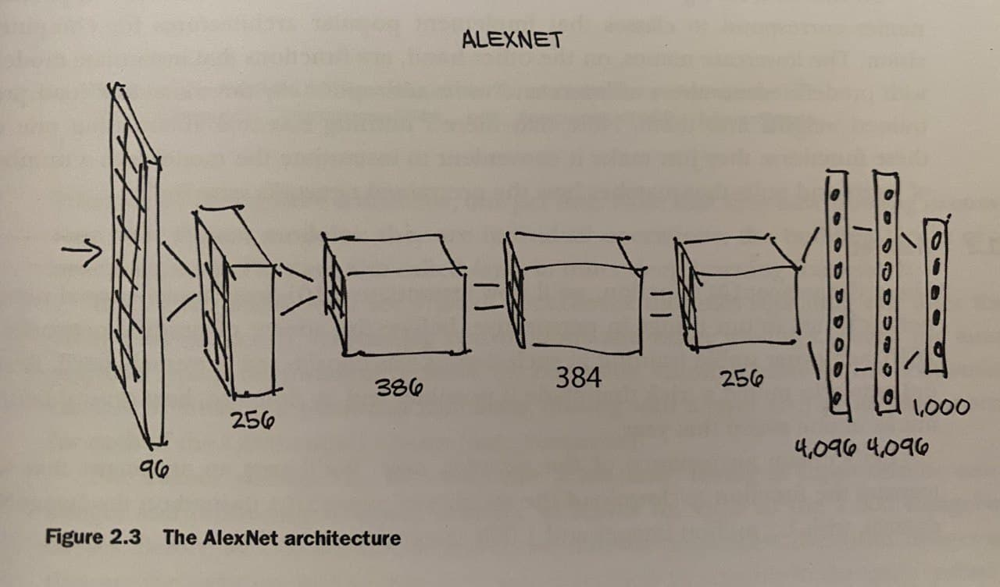

# Deep Learning / ML Basics

- In classical machine learning we were giving features to the model and using that it discriminates between different data and classifies them to different categories. However, in deep learning, the model decides which features to look at and finds out those features that were given by us before.

- This is not to say that feature engineering has no place in deep learning; we often need to inject some form of prior knowledge to deep learning models.

- First important thing about pytorch is it provides multidimensional arrays named tensors with waste amount of operations, and ability to easily move from cpu to gpu. 

- Second important thing is that it uses autograd engine to track the operations on tensors and compute derivatives with respect to any inputs.

- 

- 

**torch.\_\_file\_\_** --> shows the location where torch is installed

## Pretranined networks

#### AlexNet

This architecture was the breakthrough in deep learning. In 2012 ILSVRC competition, ALEXNET won by a large margin or 15% error where second best model which were not using deep learning has got 26% error rate.  The architecture of AlexNet is given below:

  

- This model and other famous models are loaded to **torchvision.models** and can easily applied.

- ```
  from torchvision import models
  ```

- When we type dir(models) --> to see the classes and functions in the models a big list will be outputted as given below. There we see capital **AlexNet** and **alexnet**. 
  
  **AlexNet** is the class that we can instantiate, but **alexnet** is the function that returns different models instantiated from those classes. 
  
  ```
  #In: 
  dir(models)
  
  #Out:
  ['AlexNet',
   'DenseNet',
   'GoogLeNet',
   'GoogLeNetOutputs',
   'Inception3',
   'InceptionOutputs',
   '__package__',
   '__path__',
   '__spec__',
   '_utils',
   'alexnet',
   'densenet',
   'densenet121',
   'densenet161',
   'mobilenet_v3_large',
   'resnet18',
   'resnet34',
   'resnet50',
   'shufflenetv2',
   'vgg13_bn',
   'vgg16',
   'wide_resnet50_2']
  ```

If we type **models.AlexNet(**) we will get an empty AlexNet class. We should train it from scratch or load weights. However, lower case **alexnet** --> function is equipped with the argument that we can pass to make the model load pretrained weigths.

```
alexnet = models.alexnet(pretrained=True)
```

Just **alexnet(input)** --> will give us 1000 dimension vector, which is the vector defining scores for 1000 different classes. In alexnet it is trained with **imagenet** data and output consists of 1000 different objects. 

Before we should apply preprocessing. 

```
from torchvision import transforms

preprocess = transforms.Compose([
    transforms.Resize(256),
    transforms.CenterCrop(224),
    transforms.ToTensor(),
    transforms.Normalize(mean=[0.3,0.2,0.4], 
                         std=[0.2,0.1,0.2])
])
```

After going through preprocess, we can send our data to the **alexnet** as input.

## Pytorch Tensors

- Pytorch tensors are similar to numpy arrays but with a few additional superpowers. 
  
  - Ability to perform operations on GPU
  
  - Distribute operations to multiple devices
  
  - Keep track of the graph of computations that created them

A simple one dimensional tensor with ones.

- ```
  import torch
  a = torch.ones()
  
  In [4]: a
  Out[4]: tensor([1., 1., 1.])
  ```

###### Essense of Tensors

- Python lists or tupples are collections of Python objects that are individually allocated into memory. Pytorch tensors or NumPy arrays on the other hand are views over contiguous memory blocks. Pytorch or numpy arrays are unboxed C numeric types not python objects.

```
points = torch.tensor([[5,3,2], [4,3,3]])

In [3]: points
Out[3]: 
tensor([[5, 3, 2],
        [4, 3, 3]])


In [4]: points[0]
Out[4]: tensor([5, 3, 2])
```

Here we created a tensor object and then accessed the first row of that object. Does this mean we have created a new tensor object ? Of cource not, the object is the same in the storage but a view of that storage is returned.

### Tensor element types

1) Numbers in python are objects, but in numpy they are just 32 bit floating point numbres. İn python lists, python convert the number to an object with different capabilities that need more memory. 

2) Python interpreter is slow compared to a compiled code.

3) Data types:
   
   1) torch.float32 --> default data type for tensors. 32 bit floating point number
   
   2) torch.float16 --> half precision floating-point number
   
   3) torch.int64 --> or torch.long , singned 64 bit integers

4) Default data type for floating point numbers is torch.float32 and for integers is torch.int64 

### Torch Storage

1) Values in tensors are allocated to contiguous chunks of memory managed by **torch.Storage.** 

2) **torch.Storage** is a one dimensional array. 

3) A pytorch tensor instance is a view of that storage, that can acces to the storage using **offset** and **per dimension strides**. 

```
In [49]: points = torch.tensor([[4.0, 1.0], [5.0, 3.0], [2.0, 1.0]])

In [50]: points
Out[50]: 
tensor([[4., 1.],
        [5., 3.],
        [2., 1.]])


In [51]: points.storage()
Out[51]: 
 4.0
 1.0
 5.0
 3.0
 2.0
 1.0
[torch.FloatStorage of size 6]
```

In the code above points tensor has a shape (3,2) but the storage is one dimensional. 

If you change the value in storage, it will also changed in the given tensor object.

```
stor = points.storage()
In [61]: stor
Out[61]: 
 4.0
 1.0
 1.0
 3.0
 2.0
 1.0


In [62]: stor[3] = 7

In [63]: points
Out[63]: 
tensor([[4., 1.],
        [1., 7.],
        [2., 1.]])
```

#### 

#### Tensor metadata: Size, offset and stride

1) size is the size of tensor in each dimension

```
In [69]: points.size()
Out[69]: torch.Size([3, 2])
```

2. Storage offset is the index in the storage corresponding to the first element of  the tensor.

```
In [70]: points.storage_offset()
Out[70]: 0
```

3. Stride is the number of elements in the storage that need to be skipped to obtain the next element along each dimension.

```
In [71]: points.stride()
Out[71]: (2, 1)
```

4. When get a part of the points tensor using index, a new storage will not be allocated, it will still use the same storage but its storage offset and stride will change.

```
second_point = points[1]

In [75]: second_point.storage_offset()
Out[75]: 2


In [76]: second_point.stride()
Out[76]: (1,)
```

If we change respective numbers in the **storage**, then both **second_point** and points **tensors** will also change.

Also, if we change the **second_point** tensor, both **storage** and **points** tensor will also change.

5. If we take transpose, again the storage will not change but the stride and shape will change.

```
In [129]: points_t = points.t()

In [130]: points_t
Out[130]: 
tensor([[4., 5., 2.],
        [1., 3., 1.]])


In [131]: id(points_t.storage()) == id(points.storage())
Out[131]: True


In [133]: points.stride()
Out[133]: (2, 1)

In [134]: points_t.stride()
Out[134]: (1, 2)
```

6. When we take the transpose and create **points_t**, then it will not be a contiguous tensor. 

```
In [135]: points_t.is_contiguous()
Out[135]: False
```

7. To make it contiguous again:

```
points_t = points_t.contiguous()
```

In the contiguous tensors number are alligned to the storage row by row.

### Moving Tensors to GPU

1. A tensor can be created in gpu directly.

```
points = torch.tensor([[5,3,2], [4,4,2], [4,3,3]], 
                        dtype=torch.float32, 
                        device="cuda")
```

2. Also it can be moved from cpu to gpu and vice versa.

```
points = points.to("cpu")
```

**Serializing Tensors**

1. To save and load as pickle. Disadvantage of this is that we can only load this with PyTorch.

```
torch.save(points, "test.t")

points = torch.load("test.t")
```

2. Serialize using hdf5. 

```
f = h5py.File("file.hdf5", "w")
dset = f.create_dataset("coord", data=points.numpy())
f.close()
```

## Data Representation

1. What data type each scalar representing a pixel is is encoded generally in consumer cameras?
   
   - Using 8 bit integers
   
   - In some medical, scientific and industrial applications, you can find 12bit or 16bit

2. How to load an image using imageio?

```
import imageio
img_arr = imageio.imread("filename.jpg")
In [13]: img_arr.shape
Out[13]: (1280, 960, 3)
```

3. What is the layout pytorch modules dealing with images require tensors to have?
   
   - **CxHxW** --> channel, height, witdh
   
   - in the example above the picture has shape **HxWxC**. So it should be converted to the accepted format.

4. How to correct the layout from **HxWxC** to **CxHxW** ?

```
In [10]: img_arr = img_arr.permute(2, 0, 1)

In [11]: img_arr.shape
Out[11]: torch.Size([3, 1280, 960]
```

5. What is the layout to store multiple images in a batch of arrays ? 
   
   - **NxCxHxW** --> number of images, channels, height, width

6. What are continuous, ordinal and categorical values ?
   
   - **Continuous**, is where there is a strict ordering and difference between values has a strict meaning. ex: 1,2,3,4,5,6
   
   - **Ordinal**, is where there is ordering but difference between values has no meaning.  ex: small, medium, large
   
   - **Categorical**, is where there is no ordering and difference between values does not make sense. ex: sport, economy, trade.

### Normalizing image data

1. Just divide the values of the pixels to 255, this is a little bit naive
   
   ```
   batch = batch.float()
   batch /= 255.0
   ```

2. Compute mean and standars deviation and normalise to have zero mean and unit standard deviation.

```
n_channels = batch.shape[1]
for c in range(n_channels):
    mean = torch.mean(batch[:, c])
    std = torch.std(batch[:,c])
    batch[:,c] = (batch[:,c]-mean)/std
```

### 3D images

1. Images we talked before are 2d images that are taken with a camera. In some contexts such as medical imaging, for example CT (computer tomography), we deal with sequences of images stacked from head to foot axis. 

2. In CT scans intensity is used instead of channel. 

3. Intensity represents the density of different body parts. 

4. CTs have only a single intensity channel, like a grayscale image. 

5. Layout of CT scan image : **NxCxDxHxW** --> batch size, channel, depth, height, width

**Scatter Method**:  Fills the tensor with values from a source tensor along the indices provided as arguments. 

```
target_onehot = torch.zeros(5, 4)
target = torch.tensor([2,1,1,3,2])

In [24]: target_onehot.scatter(1, target.unsqueeze(1), 1)
Out[24]: 
tensor([[0., 0., 1., 0.],
        [0., 1., 0., 0.],
        [0., 1., 0., 0.],
        [0., 0., 0., 1.],
        [0., 0., 1., 0.]])
```

first argument to scatter method is the dimension in which to add number, 

second argument is indices of the elements to scatter,

third argumnet is the number to put.

1. What does **unsqueeze** do ?
   
   - increases the dimension of the tensor in the given axis

## 


## Broadcasting

* Ability to apply operations on matrices with different sizes. There are some constraints.
1) Two dimensions are compatible when they are equal or one of them is one.

2) If the number of dimensions of matrix 1 and matrix 2 are not equal, then prepend ones to the dimension of tensor with fewer dimensions.

3) Broadcasting does not apply to inplace operations


```
a = torch.ones(3,1,2)
b = torch.ones(1,8,1)

c = a*b
c.shape
(3, 8, 2)
```


## Autograd

1. Params -> variables are started with **requires_grad=True** . Which means their calculation will be memorized and in each backward their derivatives will be **accumulated**. 
   
   1. To stop accumulation, **params.grad.zero()** should be called in each iteration. 
   
   2. when updating params, stop the autograd then start again, using with **torch.no_grad().**

```
    for epoch in range(epochs):
        if params.grad is not None:
            params.grad.zero_()
        y_hat = model(x, *params)
        loss = loss_fn(y_hat, y)
        loss.backward()
        with torch.no_grad():
            params -= (learning_rate * params.grad)
```


### Optimizer -->

Used to update the parameters automatically and apply all kinds of learning rate adaption and optimization strategies.


Code above will be decrease like this:

```
    optimizer = optim.SGD(params=[params], lr=learning_rate)
    for epoch in range(epochs):
        t_p = model(t_un, *params)
        loss = loss_fn(t_p, t_c)
        optimizer.zero_grad()
        loss.backward()
        optimizer.step()
```


**loss.backward** calculates the derivatives of all the parameters and **optimizer.step** updates those parameters using the given calculated derivatives. 


**Stochastic Gradient Descent:** The gradient is obtained by averaging a random minibatch from the whole dataset. 
